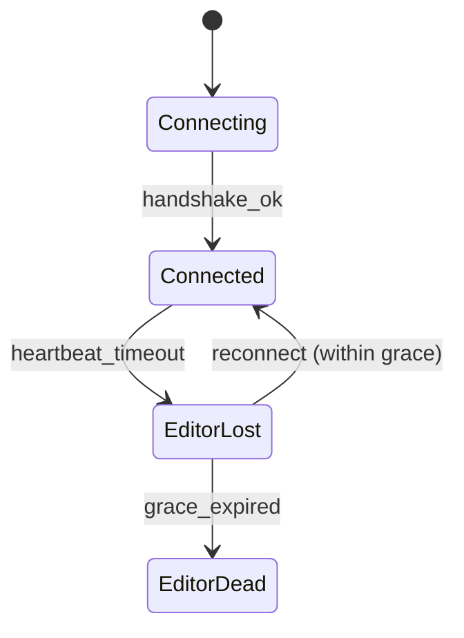

# Flowchart Decision Builder

## Overview

Converts processes into stepwise flowcharts and state diagrams for clear reasoning and visualization.

**Keywords**: flowchart, decision-tree, state-machine, process, visualization, mermaid, diagram

## Features

- Node-based structure (decision, action, terminal)
- Conditional branching with explicit labels
- State machine semantics (transitions with triggers)
- Layout guidance for readability

## Output Format

- **Mermaid `flowchart` or `stateDiagram-v2`** preferred (source-controllable, renders in markdown)
- ASCII representation as fallback for simple cases
- Brief layout note if complex (recommended orientation, swimlanes)

Example (Mermaid):

## Instructions

- Identify steps, decision points, and terminal states
- Map every conditional path explicitly
- Maintain logical flow — entry on top/left, exit on bottom/right
- For state machines: explicit transitions with trigger labels (event names, not vague descriptions)
- For Sage: prefer Mermaid since `.Codex/docs/` already uses ASCII state diagrams; Mermaid renders cleanly in GitHub and Markdown viewers

## Constraints

- Keep diagrams simple — split into multiple if a single grows beyond ~15 nodes
- Avoid unnecessary nodes (no "intermediate" nodes that don't represent real states)
- Prefer Mermaid for source-controllable diagrams
- Token discipline: render syntax compact; document only non-obvious choices
