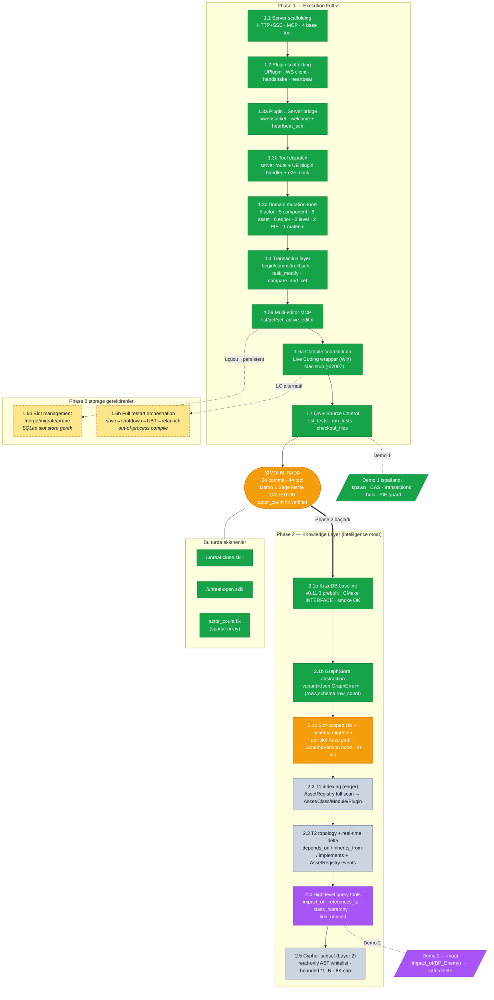
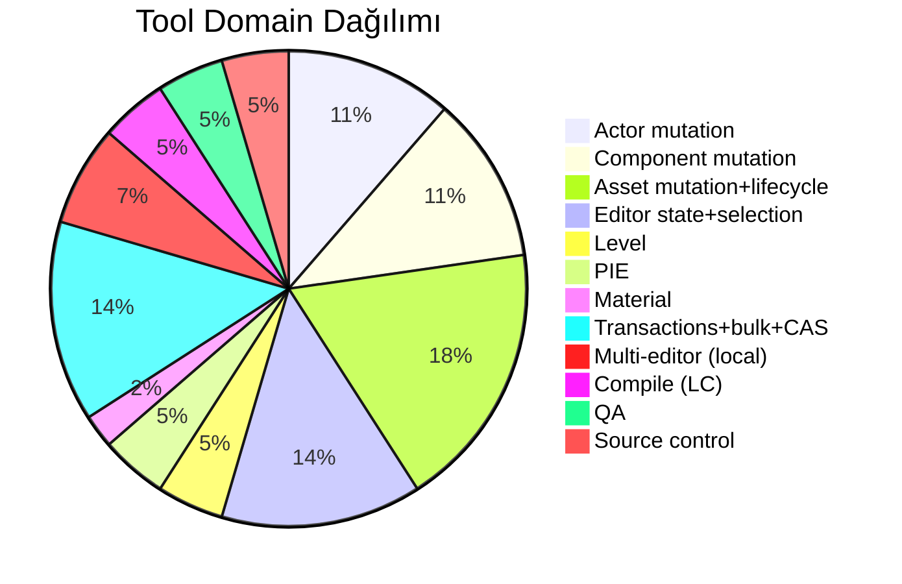

# Sage Phase 1 Durum — Şu Anda Neredeyiz

> Scratch — diyagram her güncellemede overwrite. VS Code preview'da render olur (Markdown Preview Mermaid Support).

## Phase 1 tool yüzeyi (44 tool)

## Renk kodu

- 🟢 **Yeşil** — bitti, gerçek UE 5.7 SageTest projesinde doğrulandı
- 🟠 **Turuncu** — şu anki çekilme noktası (hemen Phase 2'ye veya Windows test'e geçiş)
- ⚫ **Gri** — Phase 2 todo
- 🟡 **Sarı kesikli** — Phase 1 spec'inde olan ama Phase 2 storage layer'ına bağımlı (KuzuDB / SQLite gelmeden anlamsız)
- 🟣 **Mor** — Sage moat (intelligence layer farkı, execution'dan ayrışma)
