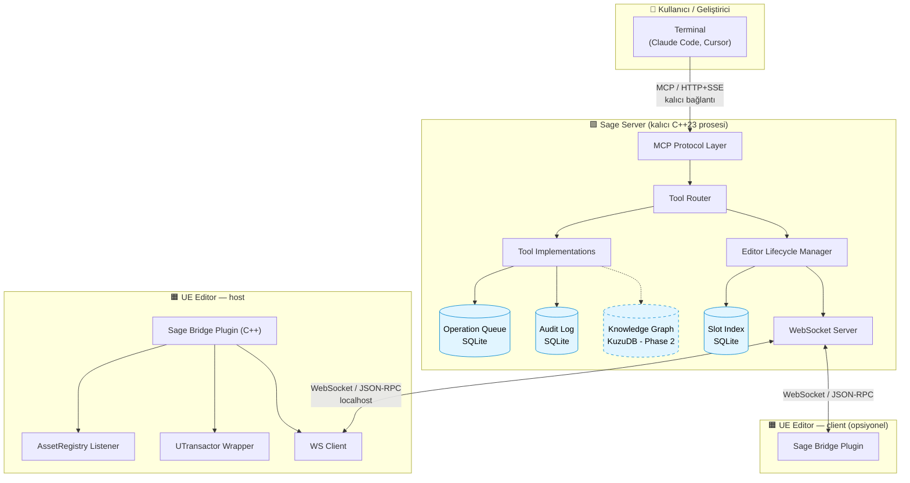
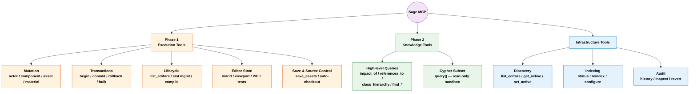
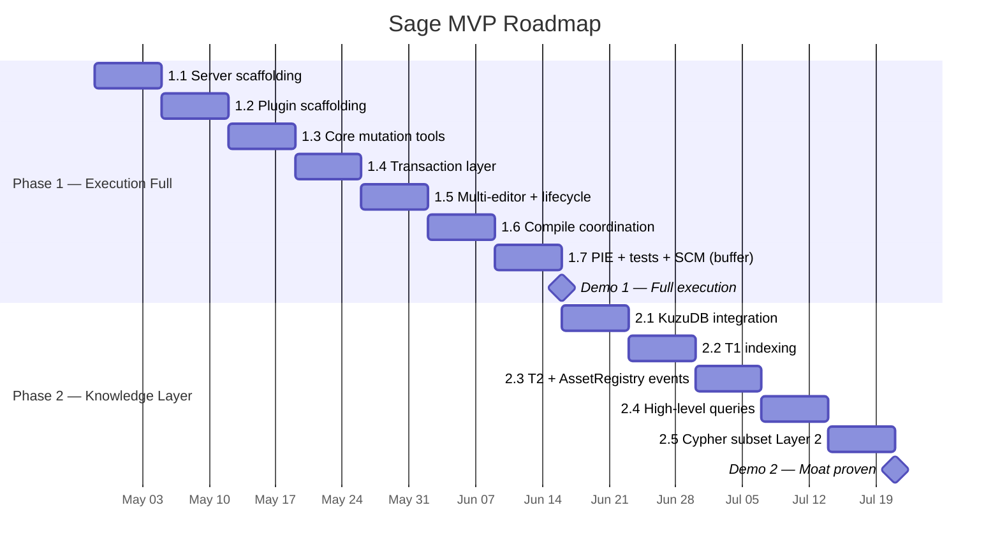
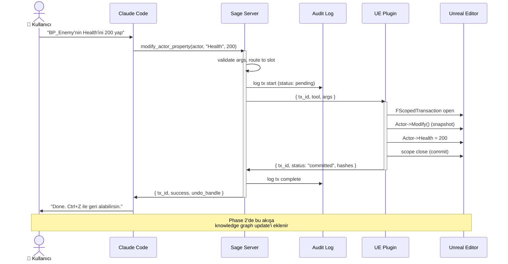

# Sage — Big Picture

> Bu dosya scratch — her yeni diyagram sürekli buraya yazılır (önceki overwrite olur).
> Kalıcı diyagramlar `.claude/docs/` veya `.claude/decisions/` içine embed edilir.
> VS Code'da `Cmd+Shift+V` ile preview aç, "Markdown Preview Mermaid Support" extension yüklü olsun.

---

## 1. System Topology — Bileşenler ve Bağlantılar

Kullanıcıdan Unreal Editor'e tüm yol. Sage server kalıcı, editor ephemeral, knowledge graph slot başına izole.

> Kesik çizgili kutu (KuzuDB) = Phase 2'de devreye girer. Phase 1'de minimum slot identity tracking var, knowledge graph queries yok.

---

## 2. Tool Taxonomy — Hangi Yetenekler Hangi Katmanda

3 ana grup: Phase 1 execution, Phase 2 knowledge, Phase 0 (her zaman) infrastructure.

---

## 3. MVP Roadmap — Zaman Çizelgesi

ADR-012'ye göre execution-first. Phase 1 tamamlandığında Demo 1 ("AI ne dersem yapıyor"), Phase 2 sonunda Demo 2 ("AI projeyi anlıyor + yapıyor").

---

## 4. Örnek Tool Call Akışı

Kullanıcı "BP_Enemy'nin Health'ini 200 yap" dediğinde sistemin uçtan uca akışı. Tek bir mutation tool çağrısı, transaction layer ve audit log dahil.

---

## Özet: Sage Nedir?

**Sözel:** Unreal Engine için MCP server family'sinin ilk üyesi. AI agent'ların Unreal projesini anlayıp güvenli mutate etmesini sağlar.

**Mimari özet:**
- Persistent C++23 server + UE C++ plugin köprüsü
- HTTP+SSE (Claude'a) + WebSocket (plugin'e) transports
- KuzuDB (knowledge graph) + SQLite (audit, slot index)
- Multi-editor support, transaction-safe, undo-integrated

**Yol haritası:**
- Phase 1 (~7 hafta): Full execution — agent komut alıp eyleyebilir
- Phase 2 (~5 hafta): Knowledge layer — agent projeyi anlayabilir
- Toplam ~12 hafta MVP, sonra Sage Unity / Sage Godot family

**Moat:** Çoğu engine MCP tool'u sadece execution. Sage'in tezi: anlama + eylem birleşimi. Phase 2 olmadan iddia, Phase 2 ile kanıt.
