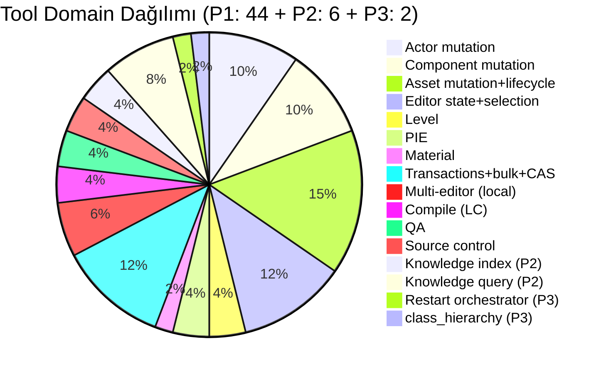
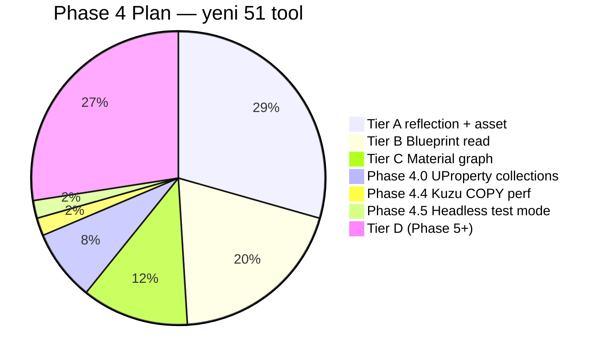

# Sage Durum — Phase 1 + Phase 2 Tamam

> Scratch — diyagram her güncellemede overwrite. VS Code preview'da render olur (Markdown Preview Mermaid Support).

```mermaid
flowchart TB
  classDef done    fill:#16a34a,stroke:#15803d,color:#fff
  classDef now     fill:#f59e0b,stroke:#d97706,color:#fff
  classDef todo    fill:#cbd5e1,stroke:#64748b,color:#0f172a
  classDef hold    fill:#fde68a,stroke:#d97706,color:#0f172a,stroke-dasharray: 6 4
  classDef moat    fill:#a855f7,stroke:#7c3aed,color:#fff

  %% Phase 1 — execution layer
  subgraph P1["Phase 1 — Execution Layer ✓ (27 commit · 44 tool)"]
    direction TB
    M11["1.1 Server scaffolding<br/>HTTP+SSE · MCP · 4 base tool"]:::done
    M12["1.2 Plugin scaffolding<br/>UPlugin · WS · handshake · heartbeat"]:::done
    M13["1.3 Bridge + 30 domain tools<br/>actor · component · asset · editor · level · PIE · material"]:::done
    M14["1.4 Transaction layer<br/>begin/commit/rollback · bulk_modify · compare_and_set"]:::done
    M15a["1.5a Multi-editor MCP<br/>list/get/set_active_editor"]:::done
    M16a["1.6a Compile coordination<br/>Live Coding wrapper (Win) · Mac stub"]:::done
    M17["1.7 QA + Source Control<br/>list_tests · run_tests · checkout_files"]:::done
  end
  M11 --> M12 --> M13 --> M14 --> M15a --> M16a --> M17

  %% Phase 2 — knowledge layer (moat)
  subgraph P2["Phase 2 — Knowledge Layer (moat) ✓ (9 commit · 6 tool · 8K/16K graph)"]
    direction TB
    M21a["2.1a KuzuDB baseline ✓<br/>v0.11.3 prebuilt · libc++ workaround"]:::done
    M21b["2.1b GraphStore abstraction ✓<br/>variant&lt;Json,GraphError&gt; · envelope"]:::done
    M21c["2.1c Slot-scoped + schema migration ✓<br/>per-slot Kuzu · _SchemaVersion · v1→v3"]:::done
    M22["2.2 T1 indexing ✓<br/>AssetRegistry full scan → Asset · 8359 row · 24ms"]:::done
    M23a["2.3a DEPENDS_ON edges ✓<br/>16093 edge · UNWIND batched"]:::done
    M23b["2.3b Real-time delta ✓<br/>OnAssetAdded/Removed/Renamed → bridge event → graph patch"]:::done
    M24["2.4 Query tools ✓<br/>impact_of · references_to · find_unused"]:::moat
    M25["2.5 Cypher subset ✓<br/>query_graph · whitelist · *1..10 · 8KB cap"]:::done
  end
  M21a --> M21b --> M21c --> M22 --> M23a --> M23b --> M24 --> M25

  %% Geçiş
  M17 ==Demo 1 ✓==> M21a

  %% Şu an
  M25 ==> NOW(["ŞİMDİ BURADA<br/>━━━━━━━━━━━━━━━<br/>38 commit · 52 MCP tool<br/>Phase 1 + 2 + 3-partial ÇALIŞIYOR<br/>SageTest UE 5.7 — 8K asset · 16K dep · 8337 class · 8336 inherit<br/>real-time delta · query_graph · class_hierarchy · restart_editor live<br/>UE-MCP 562 action audit → Phase 4 plan hazır"]):::now

  %% Phase 1'den ertelenenler
  subgraph DEF["Storage / out-of-process gerektirenler"]
    direction TB
    M15b["1.5b Slot management<br/>merge/migrate/prune<br/><i>SQLite slot store</i>"]:::hold
    M16b["1.6b Full restart orchestration<br/>save→shutdown→UBT→relaunch<br/><i>out-of-process compile</i>"]:::hold
  end
  M15a -.persistent.-> M15b
  M16a -.LC alternatif.-> M16b

  %% Phase 3 — execution polish + reflection
  subgraph P3["Phase 3 — Execution polish + T3 reflection (kısmen done)"]
    direction TB
    P3R["1.6b restart_editor orchestrator ✓<br/>save→build→kill→swap→relaunch · 25s · cross-platform"]:::done
    P3CH["class_hierarchy ✓<br/>schema v4 · 8337 UClass · 8336 INHERITS_FROM<br/>Pawn → Actor → Object verified"]:::done
    P3W["Windows cross-platform test"]:::todo
    P3PERF["Index perf — Kuzu COPY FROM JSON<br/>(30s → &lt;5s · Phase 4.4)"]:::todo
    P3SLOT["1.5b SQLite slot store<br/>merge/migrate/prune"]:::todo
  end
  NOW --> P3R
  NOW --> P3CH

  %% Phase 4 — UE-MCP capability parity
  subgraph P4["Phase 4 — UE-MCP capability parity (~3 hafta plan)"]
    direction TB
    P40["4.0 UProperty collections<br/>TArray · TMap · TObjectPtr · TSubclassOf"]:::todo
    P41["4.1 Tier A — 15 quick wins<br/>reflect_class · mesh_bounds · bulk_rename ·<br/>gameplay_tags · dialog_policy"]:::todo
    P42["4.2 Tier B — Blueprint read (10 tool)<br/>read · variables · functions · graph · execution_flow"]:::todo
    P43["4.3 Tier C — Material graph (6 tool)<br/>read · expressions · shader_stats · create_instance"]:::todo
    P44["4.4 Index perf (Kuzu COPY FROM)"]:::todo
    P45["4.5 Headless test mode<br/>(filesystem-only fallback for CI)"]:::todo
  end
  P3CH --> P40 --> P41 --> P42 --> P43 --> P44 --> P45

  %% Phase 5 — Tier D heavy lifts (on demand)
  subgraph P5["Phase 5 — Heavy lifts (on demand only)"]
    direction TB
    P5A["Animation (56 tool)<br/>AnimBP · IK Rig · ControlRig · montage"]:::todo
    P5N["Niagara (37 tool)<br/>VFX · HLSL modules · GPU shader inspect"]:::todo
    P5G["AI/Gameplay (35 tool)<br/>BT · EQS · StateTree · SmartObject · IMC"]:::todo
    P5L["PCG · Landscape · Foliage · GAS · Networking · UMG"]:::todo
  end
  P45 -.demand-driven.-> P5A
  P45 -.demand-driven.-> P5N
  P45 -.demand-driven.-> P5G

  %% Demolar
  M17  -. "Demo 1 — execution"  .- DEMO1[/"spawn · CAS · transactions · bulk · PIE guard<br/>SageTest'te ispatlandı"/]:::done
  M25  -. "Demo 2 — moat"       .- DEMO2[/"references_to(DefaultMaterial) → 5 mesh<br/>impact_of(depth=2) transitif<br/>top-5 referenced: VerseClass 300 refs<br/>banned keyword + unbounded * reddedildi"/]:::done

  %% Bu turun çıktıları
  subgraph TURN["Bu oturumun katkıları"]
    direction LR
    T1["Phase 2 baştan sona<br/>(2.1a → 2.5)"]:::done
    T2["6 yeni MCP tool<br/>(index_*, impact_of, references_to,<br/>find_unused, query_graph)"]:::done
    T3["5 integration smoke<br/>(graph · manager · indexer · cypher · kuzu)"]:::done
    T4["35/35 ctest yeşil"]:::done
  end
  NOW --- TURN
```



## MCP tool yüzeyi (52 tool toplam)



## Phase 4 hedef sürdürülen 51 tool dağılımı (UE-MCP audit'inden)



## Knowledge graph şeması (Phase 2 v3)

```mermaid
erDiagram
  Asset {
    string path PK "SoftObjectPath: /Game/Foo.Foo"
    string kind     "Blueprint, StaticMesh, ..."
  }
  Class {
    string name PK
    string module
  }
  Module {
    string name PK
    string plugin
  }
  Plugin {
    string name PK
  }
  _SchemaVersion {
    int64 id PK
    int64 value
  }
  _IndexState {
    int64 id PK
    int64 last_indexed_at_ms
    int64 asset_count
    int64 dep_count
  }

  Asset ||--o{ Asset : "DEPENDS_ON (MANY_MANY)"
```

> v3 baseline. v4'te `Class INHERITS_FROM Class` + `Asset OF_CLASS Class` rel'leri (Phase 3 class_hierarchy).

## Renk kodu

- 🟢 **Yeşil** — bitti, gerçek UE 5.7 SageTest projesinde doğrulandı
- 🟠 **Turuncu** — şu anki çekilme noktası
- ⚫ **Gri** — Phase 3 todo
- 🟡 **Sarı kesikli** — storage / out-of-process bekliyor (1.5b SQLite, 1.6b restart)
- 🟣 **Mor** — Sage moat (intelligence layer farkı)

## Phase 2 commit zinciri

| Commit  | Milestone                                              |
|---------|--------------------------------------------------------|
| 3fd226b | 2.1a KuzuDB integration baseline                       |
| a0e81fb | 2.1b GraphStore abstraction                            |
| dbd392e | 2.1c Slot-scoped manager + schema migration            |
| cd9a56a | 2.2 T1 asset indexing                                  |
| 47c2899 | 2.3a DEPENDS_ON edges                                  |
| 176587d | 2.4 Query tools (impact_of/references_to/find_unused)  |
| c0ce18f | 2.3b Real-time AssetRegistry delta                     |
| 8f0d467 | 2.5 Cypher subset (query_graph)                        |
| c5a68d7 | fix(test): pin manager smoke to kCurrentSchemaVersion  |
