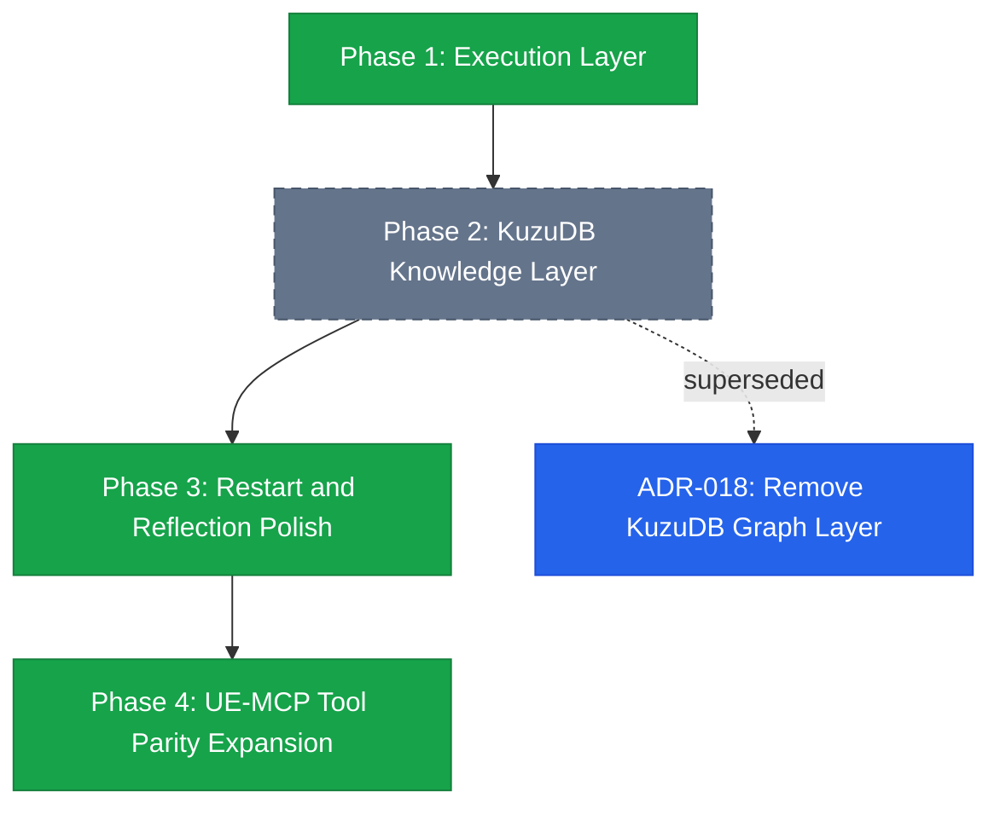

# Legacy System Diagram

> Historical archive. This diagram captures the old Phase 1 through Phase 4
> planning model. ADR-018 retired the KuzuDB-backed graph layer, so this file is
> not an active architecture source.

## Historical Milestones

- Phase 1 established the execution layer: actor, component, asset, editor,
  level, PIE, material, transaction, compile, test, and source-control tools.
- Phase 2 added the retired graph layer: KuzuDB storage, AssetRegistry indexing,
  dependency edges, high-level graph queries, and restricted Cypher.
- Phase 3 added restart orchestration and class hierarchy work.
- Phase 4 expanded tool coverage toward UE-MCP parity across Blueprint,
  material, asset, editor, project, animation, Niagara, gameplay, UMG, PCG,
  landscape, foliage, GAS, networking, and audio domains.

## Current Interpretation

Use active documents for current truth:

- `docs/architecture/architecture.md`
- `docs/adr/adr-018-remove-kuzudb-graph-layer.md`
- `README.md`
- `AGENTS.md`

This archive is useful only for understanding why earlier notes mention graph
tools such as `index_slot`, `impact_of`, `references_to`, `find_unused`,
`class_hierarchy`, or `query_graph`.
